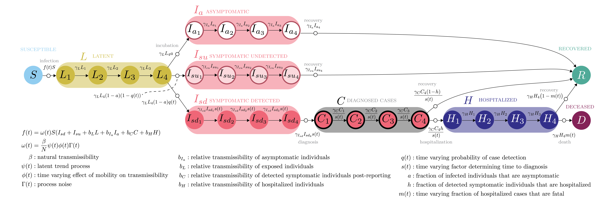

John M. Drake, Andreas Handel, Éric Marty, Eamon B. O'Dea, Tierney O'Sullivan, Giovanni Righi, and Andrew T. Tredennick,

```{r setup, include=FALSE}
knitr::opts_chunk$set(echo = FALSE, message = FALSE, warning = FALSE)
library(tidyverse)
library(ggthemes)

diff_colors <- c("#EA4335", "#4285F4")
```

\renewcommand{\thefigure}{S\arabic{figure}}
\renewcommand{\thetable}{S\arabic{table}}

# Model diagram




# Model parameters

Table: Fixed model parameters.

| Parameter definition | Parameter symbol | Value | Source |
| -------------------------- | -------- | --------- | ------ |
| Reproduction number | $\mathcal{R}_0$ | 7 | Sanche et al. (2020) |
| Transmission rate of symptomatic individuals | $\beta$ | $\mathcal{R}_0 \times 0.1 \times \frac{1}{N}$ | Assumption |
| Fraction of infected individuals that are asymptomatic | $a$ | 0.18 | Mizumoto et al. (2020);  |
| Fraction of diagnosed cases that are hospitalized | $h$ | 0.12 | Verity et al. (2020) |
| Relative transmissibility of $L$ to $I_{su/sd}$ | $b_L$ | 0.12 | Li et al. (2020) |
| Relative transmissibility of $I_{a}$ to $I_{su/sd}$ | $b_{I_a}$ | 0.5 | Li et al. (2020) |
| Relative transmissibility of $C$ to $I_{su/sd}$ | $b_{I_a}$ | 0.27 | Assumption |
| Relative transmissibility of $H$ to $I_{su/sd}$ | $b_{I_a}$ | $4.5\times10^{-5}$ | Moghadas et al. (2020) |
| Rate of movement through a single $L$ stage | $\gamma_L$ | $\frac{1}{1 \text{ days}}$ | Li et al. (2020) | 
| Rate of movement through a single $I_{a}$ stage | $\gamma_{I_{a}}$ | $\frac{1}{0.88 \text{ days}}$ | Li et al. (2020) | 
| Rate of movement through a single $I_{su}$ stage | $\gamma_{I_{su}}$ | $\frac{1}{1.5 \text{ days}}$ | Li et al. (2020) | 
| Rate of movement through a single $I_{sd}$ stage | $\gamma_{I_{su}}$ | $\frac{1}{0.75 \text{ days}}$ | Assumption |
| Rate of movement through a single $C$ stage | $\gamma_{C}$ | $\frac{1}{0.75 \text{ days}}$ | Assumption |
| Rate of movement through a single $H$ stage | $\gamma_{H}$ | $\frac{1}{1.5 \text{ days}}$ | Moghadas et al. (2020) |
| Minimum detection probability | $q_\text{min}$ | 0.1 | Assumption |
| Maximum detection probability | $q_\text{max}$ | 0.4 | Assumption |
| Day at which detection probability is halfway between $q_\text{min}$ and $q_\text{max}$ | $q_\text{half}$ | 30 | Assumption |
| Rate of increase from $q_\text{min}$ to $q_\text{max}$ | $q_\text{r}$ | 1.0 | Assumption |
| Maximum factor by which diagnosis speed incrases | $s_\text{max}$ | 1.0 | Assumption |
| Day at which diagnosis speed-up factor ($s$) is halfway between 0 and $s_\text{max}$ | $s_\text{half}$ | 30 | Assumption |
| Rate of increase from 0 to $s_\text{max}$ | $s_r$ | 1.0 | Assumption |
| Initial size of susceptible pool | $S(t=1)$ | $N_{\text{state}}$ | Assumption |


Table: Estimated parameters and starting ranges for MIF estimation procedure.

| Parameter definition | Parameter symbol | Start range |
| ----------------------------- | ----- | ----------- |
| Baseline fraction of hospitalizations that result in death | $m_\text{base}$ | [expit(-6), expit(6)] |
| Minimum fraction of hospitalizations that result in death | $m_\text{min}$ | [expit(-6), expit(6)] |
| Day at which death fraction is halfway between $m_\text{base}$ and $m_\text{min}$ | $m_\text{half}$ | [exp(-5), exp(5)] |
| Extra-demogaphic process noise | $\sigma$ | [exp(-5), exp(5)] |
| Case reporting dispersion | $\theta_c$ | [exp(-5), exp(5)] |
| Death reporting dispersion | $\theta_d$ | [exp(-5), exp(5)] |
| Initial size of latent compartment  | $L(t=0)$ | [exp(0), exp(10)] |
| Initial size of asymptomatic infectious compartment | $I_a(t=0)$ | [exp(0), exp(10)] |
| Initial size of undetected infectious compartment | $I_{su}(t=0)$ | [exp(0), exp(10)] |
| Initial size of detected infectious compartment | $I_{sd}(t=0)$ | [exp(0), exp(10)] |
| B-spline coefficients | $g_i$ | [-10, 10] |


# Mean absolute scaled errors (MASE)

The MASE is a ratio of mean absolute error (MAE) in the model to MAE of an in-sample naïve model (a random walk forecast from the last observation, adjusted for weekly seasonality). 
MASE values were calculated for each of the 500 particle filter replicates for each state using the **yardstick** package in R.
Most states had a mean MASE less than one for cases, while MASE was greater than one for deaths for most states.
Thus, our model does not always outperform the benchmarking model, but it does offer mechanistic insight that the random walk model does not.


```{r mase, fig.width=8.5, fig.height=6, fig.cap="Mean and 95% intervals of mean absolute scaled errors (MASE) for each state. MASE was calculated for each of the 500 particle filter replicates for each state, yielding a distribution of MASE values. The point shows the mean of the MASE distribution and the errorbars show the 95% interval (lower 0.025 quantile to upper 0.975 quantile). States are ranked approximately from lowest MASE to highest MASE across both cases and deaths."}
mases <- readRDS("./code/mases.RDS") %>%
  mutate(name = case_when(name == "cases" ~ "New cases",
                          TRUE ~ "New deaths")) %>%
  mutate(sig = case_when(upper95_mase < 1 ~ "better",
                         lower95_mase < 1 & upper95_mase > 1 ~ "same",
                         lower95_mase > 1 ~ "worse",
                         TRUE ~ "ERROR"))
ggplot(mases, aes(x = reorder(location, mean_mase), 
                  y = mean_mase,
                  color = sig)) +
  geom_hline(aes(yintercept = 1), linetype = 2) +
  geom_point() +
  geom_errorbar(aes(ymin = lower95_mase, ymax = upper95_mase), width = 0.1) +
  xlab(NULL) +
  ylab("Mean absolute scaled error") +
  # coord_cartesian(ylim = c(0, 1)) +
  ggthemes::theme_few() +
  facet_wrap(~name, ncol = 1) +
  scale_color_manual(values = c(diff_colors[2], "grey35", diff_colors[1]), 
                     labels = c("MASE < 1", "MASE = 1", "MASE > 1"),
                     name = NULL) +
  theme(axis.text.x = element_text(angle = 90, vjust = 0.5, hjust=1),
        legend.position = c(0.1, 0.85)) 
```


\newpage{}

# Time series of incident case and death reports

In the following plots, orange points are the reported daily cases or deaths, white line shows the median of the smoothed filtering distributions, and the grey ribbon bounds the 95% prediction interval.

```{r, fig.width=8.5, fig.height=3.5}
dat <- readRDS("code/all-states-data.RDS")
fit_all <- readRDS("code/all-states-filters-summaries.RDS")

dat <- dat %>%
  dplyr::select(location, date, cases, deaths) %>%
  pivot_longer(cols = cases:deaths, values_to = "observation")
fit <- fit_all %>%
  filter(name %in% c("C_new", "D_new")) %>%
  mutate(name = case_when(name == "C_new" ~ "cases",
                          TRUE ~ "deaths"))
dat_fit <- dat %>%
  left_join(fit, by = c("location", "date", "name"))

for(loc in unique(dat_fit$location)) {
  tmp <- dat_fit %>%
    filter(location == loc)
  p <- ggplot(tmp, aes(x = date, y = observation)) +
    geom_ribbon(aes(ymin = lower_95_value, ymax = upper_95_value)) +
    geom_line(aes(y = median_value), color = "white") +
    geom_point(size = 0.5, color = "orange") +
    facet_wrap(~name, scales = "free_y") +
    ylab("New reports") +
    ggtitle(loc)
  print(p)
}
```


\newpage{}

# Time series of mobility, estimated latent trend, and $\mathcal{R}_e$

The following plots show the estimated latent trend, relative mobility, and estimated $\mathcal{R}_e$ over time for each state. 
The latent trend is estimated using the maximum likelihood parameter estimates for the $g_i$ coefficients of the B-spline (see Materials and Methods in main text).

```{r, fig.width=8.5, fig.height=3.5}
trends <- fit_all %>%
  filter(name %in% c("latent_trend", "mobility", "R_e"))
for(loc in unique(trends$location)) {
  tmp <- trends %>%
    filter(location == loc)
  p <- ggplot(tmp, aes(x = date, y = median_value)) +
    geom_line(aes(y = median_value), size = 1) +
    facet_wrap(~name, scales = "free_y") +
    ylab("value") +
    ggtitle(loc)
  print(p)
}
```


